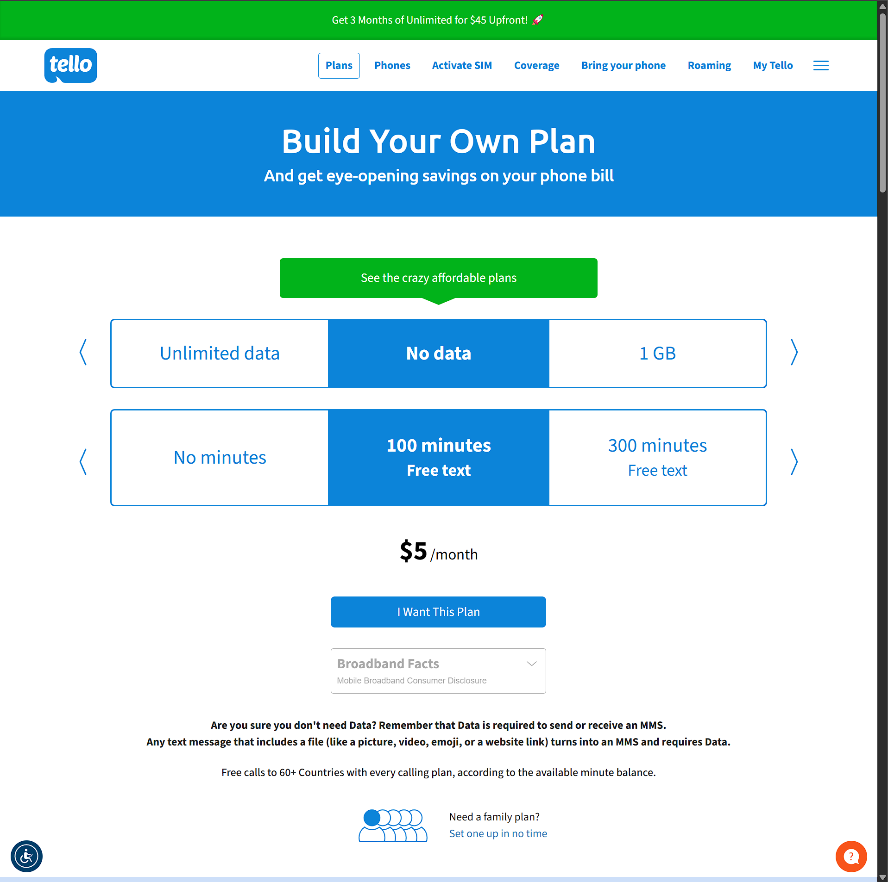
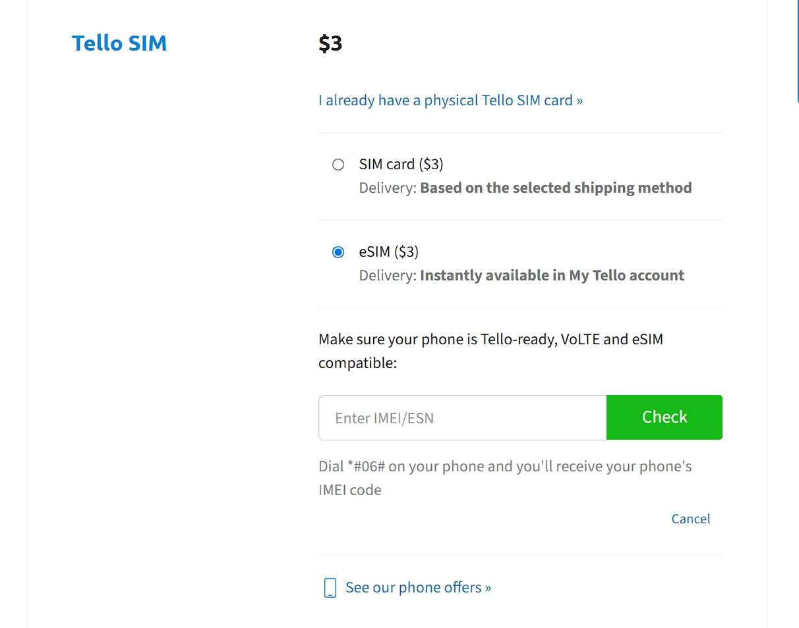

# 🧾 2025年如何优雅的拥有一张美国实体运营商电话卡

> 本教程适合希望在2025年以最低的承办办理一张属于自己的美国实体运营商电话卡的友友，内容涵盖注册、购买套餐、填写转号信息、等待过程与后续设置。支持在国内远程操作，支持国内银行卡，绝不会砍单，本教程不需科学上网，也不含任何关于科学上网等方面的指导。
> Tello当前最大的优势是不用养号，用国内信用卡即可完成购买和续费，上官网也完全不用科学上网。

---

## 👤 一、注册 Tello 账号

1. 打开Tello官网(https://tello.com/account/register?_referral=P3JNX8GX)
2. 点击右上角 **Sign Up** 注册
3. 从此步开始要保证IP保持在国内，不要使用Facebook、Google或者Apple等服务登陆，请参考下图依次填写
   - First Name：名字的拼音
   - Last Name：姓氏的拼音
   - Email：能收到邮件的邮箱地址作为验证和登陆凭证
   - Password/Confirm password：设置密码并确认
   - Referral code：如果没有从我上面的地址进入，请点击蓝色的字Referral code，出现一个新框，并要确保填写了我给您提供的邀请码P3JNX8GX，确认无误后完成邮箱验证，这一项一定要填写，否则无法获得10刀余额。

4. 登陆后进入后台，在左侧菜单选择My information：
   - First Name / Last Name：和注册时同样的姓名姓氏
   - Address Line1：使用你国内的地址即可用拼音即可，顺序为 小区、街、县/市/区，比如：北京市朝阳区建国路93号万达广场A座1908室，写作：Room 1908, Tower A, Wanda Plaza, No. 93 Jianguo Road, Chaoyang District, Beijing, China
   - Address Line2：一般留空
   - Zip Code：你所在地址邮编
   - City：所在市
   - State：所在省

---

## 💳 二、选择并购买套餐

1. 登陆后点击导航栏的 **Plans > Build Your Own**
2. 选择一个套餐（推荐：0GB + 无限通话短信，$5/月）
3. 点击 **I Want this Plan**进入**Checkout**环节

---

## 💳 三、支付环节

1. My Number，可以先不管，任他随机，后面如果有想更换的号码可以再转入
2. 填写使用地址：任意的美国地址，或者你想使用的号码所在地，可以用美国地址生成器(https://www.meiguodizhi.com/)随机生成一个，也可以谷歌地图找一个真实的美国地址，如果实在懒得找，可以照着图上的填写。

3. 选择SIM卡形式，一般来讲Tello现在是不支持直邮到国内的，如果你有朋友在国外或者具备娴熟海淘经验可以走转运选择实体SIM，否则一律建议使用eSIM，国行手机无法使用eSIM，可以使用[estk.me](https://www.estk.me/)购买一张可写号的sim卡。

上面的验证IMEI不要填写国行手机或者任何不支持ESIM的手机，如果你的设备支持ESIM，直接拨号键盘输入*#06#查询并填入，如果不希望自己设备信息泄露，或者没有eSIM手机，可以使用随机IMEI生成器计算(https://www.imei.info/zh/imei-generator/)，我下面给大家提供几组，直接复制就行。
- 356303489884815, 356303481643169, 356303481306403, 356303485091217, 356303482632229, 356303482305487, 356303486177163, 356303489086577, 356303481790630, 356303482604178
4. 下面开始填写最重要的支付信息，相信大家都会有几张国内银行卡发行的Master Card或者VISA卡，如果没有，可以自己办理，很方便。

这里不要使用任何虚拟信用卡，会砍单，砍单后我们刚才注册的账号会被限制登录，且无法重新使用该邮箱注册，之前所有努力都会白费，一定要在中国IP使用中国正规银行发行的双币种或外币信用卡进行支付。
5. 上面流程都搞定后，点击Finalize Order进行支付。

## 🛒 四、订单状态
如果按照我的教程一步一步走下来，下面大家会被定向至order status界面，如果成功会提示你sucessfully，如果失败会提示你refunded，成功了，恭喜你即将进入激活eSIM流程，如果失败，不要气馁，看看自己哪一步没做好，重新找个邮箱，重复进行也行，如果实在苦手，可以telegram联系我帮忙解决。

##  五、激活eSIM
1. 订单完成后，点击右上角 [My Tello](https://tello.com/account/home)，在右侧菜单选择My SIM

2. 右侧的界面将有个二维码，使用你支持eSIM的设备扫描即可成功下卡。